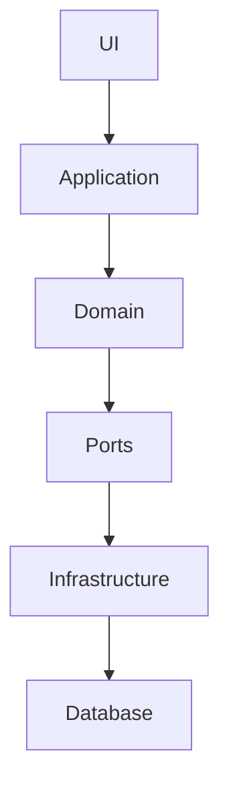

# Dependency DAG & Data Flow

## Purpose

Reconstruct the architecture from evidence and produce a useful target dependency DAG.

Do not reduce the system to one graph.

At minimum distinguish:

1. static dependency graph
2. runtime dependency graph
3. data-flow graph
4. state-ownership graph
5. persistence/database graph
6. historical co-change graph when Git history exists

The objective is:

> Turn implicit and cyclic relationships into explicit, directional boundaries with predictable change propagation.

---

## 1. Establish Boundaries

Identify:

- entry points
- applications
- modules/packages
- domain components
- services
- repositories/data access
- external APIs
- queues/events
- caches
- configuration
- filesystem
- database
- background jobs
- UI/API/CLI boundaries

Treat external systems as explicit nodes.

---

## 2. Static Dependency Graph

Extract:

- imports
- calls
- inheritance
- composition
- construction
- dependency injection
- generated-code dependencies

Represent `A → B` as A depending on B.

Find:

- cycles
- strongly connected components
- high fan-in nodes
- high fan-out nodes
- hub/god modules
- boundary violations

Do not assume imports capture runtime dependencies.

---

## 3. Runtime Dependency Graph

Find dependencies introduced through:

- dependency injection
- service locators
- registries
- factories
- reflection
- plugins
- decorators
- event subscriptions
- callbacks
- queues
- configuration

Label edges: `explicit`, `implicit`, `dynamic`, `inferred`.

Dynamic and inferred edges must be called out.

---

## 4. Data Flow

For important use cases, trace:

```text
input
→ parsing
→ validation
→ transformation
→ domain operation
→ persistence
→ external effects
→ output
```

Identify every meaningful representation change, e.g.:

```text
HTTP JSON
  ↓
DTO
  ↓
validated command
  ↓
domain object
  ↓
repository
  ↓
SQL row
```

Mark hidden transformations and hidden state.

---

## 5. State Ownership

For important mutable state, identify:

```text
state → owner → mutators → readers
```

Flag:

- multiple owners
- unrestricted mutation
- global state
- caches
- sessions
- transaction state
- lifecycle-managed resources

If ownership cannot be determined, mark it unknown.

---

## 6. Database as a First-Class Graph

Inspect:

- tables
- columns
- primary keys
- foreign keys
- unique constraints
- nullability
- indexes when architecturally relevant
- cascades
- triggers
- views
- stored procedures
- generated columns
- enums/domain constraints
- migrations

Build relationships such as `orders ──FK──→ customers`.

Map application code to persistence:

```text
OrderService
    ↓
OrderRepository
    ↓
orders
```

Identify:

- tables accessed by unrelated modules
- direct SQL from domain/application code
- schema constraints absent from application assumptions
- application invariants absent from DB where they need persistence enforcement
- contradictory DB/application invariants
- persistence details leaking upward

---

## 7. Historical / Empirical Architecture

If Git history is available, construct a co-change graph.

For files/modules A and B, inspect `P(B changes | A changes)` and `P(A changes | B changes)`, and normalized co-change measures.

Also inspect:

- repeated co-change
- change fan-out
- change entropy
- temporal ordering
- files frequently changed together despite no declared dependency

Do NOT call co-change proof of dependency. Call it **empirical coupling evidence**.

Compare this graph against the declared dependency graph.

Particularly valuable discrepancies: historical coupling exists but static dependency does not. This may indicate hidden semantic coupling, shared schema/invariant, missing abstraction, poor module boundary, common external dependency, or merely coincidental change patterns.

Investigate before restructuring.

---

## 8. Produce Separate Graph Views

### A. Declared Dependency DAG



Adapt the architecture to the actual system. Do not impose this example.

### B. Runtime Graph

Include dynamic wiring and event/callback relationships.

### C. Data Flow

Show important use cases independently.

### D. State Ownership

Show who owns and mutates important state.

### E. Persistence Graph

Show application components ↔ repositories ↔ tables and important table relationships.

### F. Historical Coupling Graph

Show strongest empirical relationships when Git history is available.

For large systems, split graphs by subsystem.

---

## 9. Find Spaghetti

Identify:

**Cycles**: `A → B → C → A`

**Bidirectional knowledge**: `A ↔ B`

**Hidden edges**: runtime behavior absent from ordinary call/import structure.

**God nodes**: nodes with unusually broad relationships.

**Shared mutable state**: state accessed or mutated from many components.

**Database hubs**: tables directly manipulated by many unrelated components.

**Cross-layer shortcuts**: `UI → SQL`, `domain → HTTP`, `repository → UI`.

**Mixed concerns**: a single component simultaneously performs policy + persistence + IO + transformation.

---

## 10. Analyze Cycles Semantically

For each significant cycle, determine whether it is:

1. accidental
2. caused by mutual domain concepts
3. infrastructure-related
4. ownership-related
5. callback/event-related
6. genuinely irreducible

Do not simply prescribe "remove the cycle." Explain what semantic relationship creates it.

---

## 11. Find Cut Points

For each cycle or high-coupling region, find the smallest useful architectural cut.

Possible cuts: function, interface/port, DTO, repository, adapter, command/query boundary, event, ownership transfer, module boundary.

Prefer a cut that removes several problematic edges at once.

---

## 12. Propose the Target DAG

Design a directional architecture appropriate to the actual system.

Prefer explicit dependencies, stable boundaries, one-way knowledge, clear state ownership, explicit data flow, isolated effects, and database access through deliberate persistence boundaries.

The target does not have to be layered architecture. A different DAG may be better for the domain.

---

## 13. Validate Against Historical Behavior

A target architecture is suspicious if Git history repeatedly shows changes crossing the proposed boundaries.

Ask:

```text
Would the proposed boundary separate files that historically change together?
Would common changes now require awkward coordination?
Does the target reduce empirical coupling or merely hide it?
```

A successful restructure should generally reduce unpredictable cross-boundary change propagation.

---

## 14. Migration Plan

Do not recommend a giant rewrite.

For each migration, present:

```text
Current:
A → B → C → A

Cut:
Introduce interface X

Target:
B → X ← C

Steps:
1. define X
2. implement adapter
3. migrate B
4. migrate C
5. remove old edge
6. run tests
7. verify cycle/coupling reduction
```

Prefer reversible and independently testable steps.

---

## Output

### System Model

Short description of the observed architecture.

### Current Dependency Graph

Graph + explanation.

### Current Data Flows

Important use cases.

### State Ownership

Table:

| State | Owner | Mutators | Readers | Confidence |
|---|---|---|---|---|

### Database Graph

Tables, relationships, application mappings, and relevant constraints.

### Historical Coupling

Strongest empirical relationships and static/history disagreements.

### Cycles

For each:

```text
Cycle:
Why it exists:
Why it matters:
Potential cut:
Confidence:
```

### Hotspots

Rank by architectural significance.

### Target DAG

Graph + rationale.

### Migration Plan

Ordered incremental changes.

### Validation Criteria

Specify what should become measurably better: fewer cycles, lower cross-boundary coupling, lower change fan-out, lower change entropy where appropriate, clearer ownership, fewer hidden effects, smaller/predictable blast radius.

### Unknowns

Explicitly list inferred or unobservable relationships.
